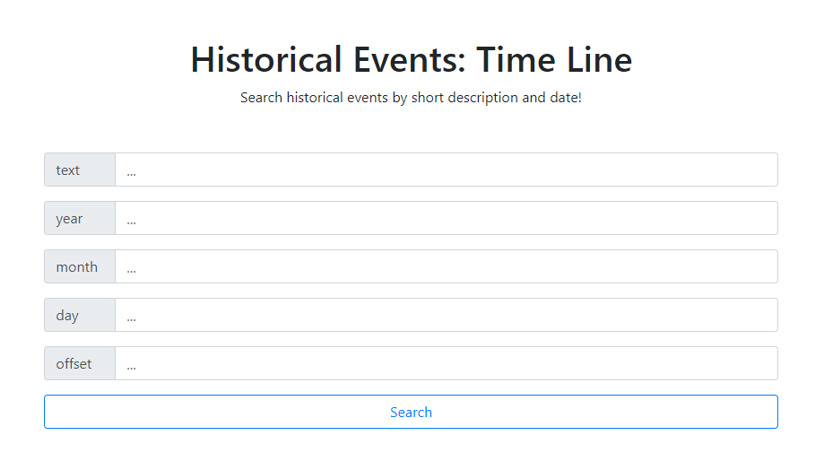

# Historical Events: Time Line
#### Search historical events by short description and date!

---

 

 

### Quick project overview
A very small flask web application developed as a wrapper over the [historical events API](https://api-ninjas.com/api/historicalevents). 
As the name suggests, this web application can <i><b>display important historical events using a short description or keywords</b></i>; 
you can also <i><b>specify the exact date of the event for a more precise search</b></i>. After searching, you will be given the results in the form of a short summary and a Wikipedia link to similar articles.

 

### How to start project ...?
1. Install [Python](https://www.python.org/downloads/) than install [Flask](https://pypi.org/project/Flask/), that's all you need :)
2. You need <i><b>API-KEY</b></i> so register [here](https://api-ninjas.com/register), they have free plan, and get your key. 
Then edit `conf.py` with your <i><b>API-KEY</b></i>.